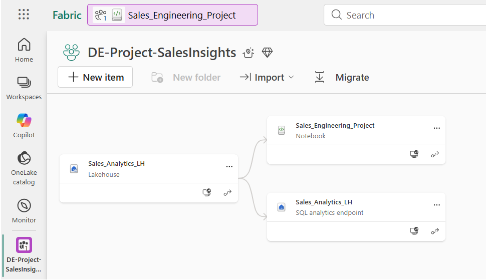
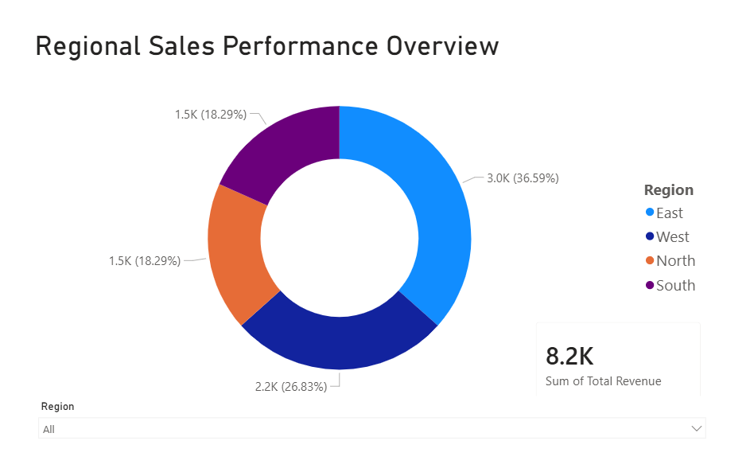

# End-to-End Medallion Pipeline in Microsoft Fabric

## 🚀 Project Overview
I designed and implemented a rapid-deployment data pipeline within **Microsoft Fabric** to transform raw e-commerce sales data into a business-ready "Gold" layer. This project leverages the **Medallion Architecture** to move data from ingestion to high-level executive insights using PySpark, SQL Analytics Endpoints, and Power BI.

## 🏗️ Architecture & Data Flow
The project follows the Medallion design pattern to ensure data quality and performance:
- **Bronze (Ingest):** Raw CSV data landed in OneLake.
- **Silver (Refine):** Utilized Spark Notebooks for data cleansing, handling nulls, and schema enforcement to ensure a "Single Source of Truth."
- **Gold (Aggregate):** Created high-performance Delta tables optimized for regional sales performance and executive reporting.

## 🛠️ Tech Stack
- **Platform:** Microsoft Fabric
- **Compute Engine:** Apache Spark (PySpark)
- **Storage:** OneLake / Delta Lake
- **Analytics:** SQL Analytics Endpoint
- **Visualization:** Power BI (DirectLake Mode)

## 📊 Business Intelligence & Visualization
Developed a **Regional Sales Performance Overview** dashboard in Power BI using **DirectLake** connectivity to provide real-time visibility into revenue streams across four key territories.

### **Key BI Features:**
*   **DirectLake Integration:** Achieved sub-second query performance by allowing Power BI to read Delta tables directly from OneLake, completely eliminating the need for traditional data refreshes.
*   **Interactive Analytics:** Implemented regional slicers and KPI cards to track total revenue and volume trends dynamically.
*   **Unified UI:** Synchronized color-theming and custom layering to provide an executive-grade user experience.

## 📈 Key Engineering Achievements
- **Schema Enforcement:** Guaranteed data integrity during the Silver layer transformation.
- **ACID Transactions:** Utilized Delta Lake format to ensure reliability and consistency across the pipeline.
- **Zero-Copy Architecture:** Optimized the Fabric environment to minimize storage costs and data movement by leveraging the SQL Analytics Endpoint.

---

### 🔗 Project Links
* [View Interactive Dashboard](https://app.fabric.microsoft.com/reportEmbed?reportId=a0bf4c8b-78ef-4aaf-bd1d-73e20e9fccae&autoAuth=true&ctid=bd697c1b-c481-479c-841e-c618542675c3)
*(Note: Access may require organization-level authentication)*
